# Modelo relacional — PrimeLux SmartShop

Diagrama de entidad-relación con todas las tablas del sistema y sus relaciones.

```mermaid
erDiagram

    users {
        int         id              PK
        varchar     name
        varchar     last_name
        varchar     email           UK
        varchar     password
        enum        role
        enum        status
        datetime    created_at
        datetime    updated_at
    }
    login_attempts {
        int         id              PK
        varchar     email
        varchar     ip_address
        boolean     success
        datetime    created_at
    }
    password_resets {
        int         id              PK
        varchar     email
        char        token_hash
        datetime    expires_at
        boolean     used
        datetime    created_at
    }
    two_factor_codes {
        int         id              PK
        int         user_id         FK
        char        code_hash
        datetime    expires_at
        datetime    used_at
        tinyint     failed_attempts
        datetime    blocked_until
        varchar     request_ip
        datetime    created_at
    }
    addresses {
        int         id              PK
        int         user_id         FK
        varchar     street
        varchar     city
        varchar     province
        varchar     postal_code
        varchar     country
        varchar     phone
        boolean     is_default
    }
    categories {
        int         id              PK
        varchar     name
        varchar     slug            UK
        text        description
        int         parent_id       FK
        enum        status
        datetime    created_at
    }
    products {
        int         id              PK
        varchar     name
        varchar     slug            UK
        text        description
        decimal     base_price
        enum        status
        datetime    created_at
        datetime    updated_at
    }
    product_categories {
        int         product_id      FK
        int         category_id     FK
    }
    variants {
        int         id              PK
        int         product_id      FK
        varchar     name
        decimal     extra_price
        int         stock
    }
    product_images {
        int         id              PK
        int         product_id      FK
        varchar     image_url
        boolean     is_main
    }
    carts {
        bigint      id              PK
        int         user_id         FK
        enum        status
        datetime    created_at
        datetime    updated_at
    }
    cart_items {
        bigint      id              PK
        bigint      cart_id         FK
        int         variant_id      FK
        int         quantity
    }
    orders {
        int         id              PK
        int         user_id         FK
        enum        status
        enum        shipping_type
        decimal     shipping_cost
        decimal     total
        varchar     stripe_session_id
        datetime    created_at
    }
    order_items {
        bigint      id              PK
        int         order_id        FK
        int         variant_id      FK
        varchar     product_name_snapshot
        int         quantity
        decimal     unit_price
        decimal     subtotal
    }
    payments {
        bigint      id              PK
        int         order_id        FK
        varchar     payment_provider
        varchar     external_payment_id
        enum        payment_method
        enum        payment_status
        decimal     amount
        varchar     currency
        datetime    paid_at
    }
    interactions {
        bigint      id              PK
        int         user_id         FK
        int         product_id      FK
        enum        type
        datetime    created_at
    }
    view_history {
        bigint      id              PK
        int         user_id         FK
        int         product_id      FK
        datetime    created_at
    }
    user_interests {
        int         user_id         FK
        int         category_id     FK
        int         interest_score
        timestamp   last_interaction
    }
    reviews {
        int         id              PK
        int         user_id         FK
        int         product_id      FK
        tinyint     rating
        text        comment
        datetime    created_at
    }
    conversations {
        int         id              PK
        int         user_id         FK
        varchar     subject
        enum        status
        datetime    created_at
    }
    messages {
        bigint      id              PK
        int         conversation_id FK
        int         user_id         FK
        text        message
        boolean     is_read
        datetime    created_at
    }

    users            ||--o{ two_factor_codes   : "genera"
    users            ||--o{ addresses          : "tiene"
    users            ||--o{ carts              : "posee"
    users            ||--o{ orders             : "realiza"
    users            ||--o{ interactions       : "genera"
    users            ||--o{ view_history       : "acumula"
    users            ||--o{ user_interests     : "tiene"
    users            ||--o{ reviews            : "escribe"
    users            ||--o{ conversations      : "abre"
    users            ||--o{ messages           : "envía"
    categories       ||--o{ categories         : "subcategoría de"
    categories       ||--o{ product_categories : "agrupa"
    categories       ||--o{ user_interests     : "interesa a"
    products         ||--o{ product_categories : "pertenece a"
    products         ||--o{ variants           : "tiene"
    products         ||--o{ product_images     : "tiene"
    products         ||--o{ interactions       : "recibe"
    products         ||--o{ view_history       : "aparece en"
    products         ||--o{ reviews            : "recibe"
    variants         ||--o{ cart_items         : "añadido en"
    variants         ||--o{ order_items        : "comprado en"
    carts            ||--o{ cart_items         : "contiene"
    orders           ||--o{ order_items        : "contiene"
    orders           ||--|| payments           : "liquidado en"
    conversations    ||--o{ messages           : "contiene"
```

## Notas del modelo

**21 tablas** organizadas en 4 bloques: usuarios y seguridad (5), catálogo (5), carrito y pedidos (5), recomendaciones y soporte (6).

**Snapshots en pedidos** — `order_items` guarda nombre, precio unitario y subtotal en el momento de la compra. Si un producto cambia o se elimina, el historial no se ve afectado.

**Variantes como unidad de stock** — el stock se gestiona en `variants`, no en `products`.

**Subcategorías** — `categories.parent_id` permite jerarquía sin límite de profundidad.

**Tabla `reviews`** — creada en el schema, sin implementación de interfaz todavía. Ver `docs/decisions/001-reviews-deferred.md`.
